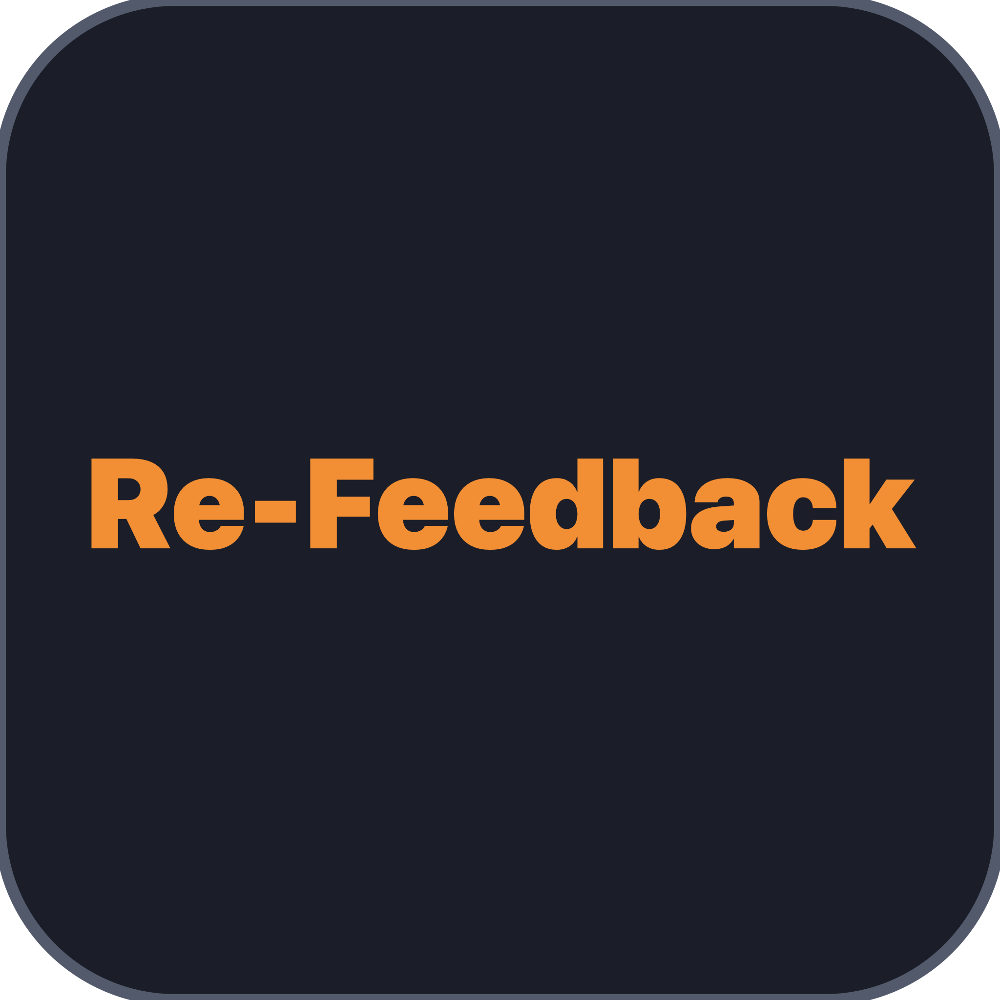

<p align="center">
  
</p>

# Re-Feedback
### Pure Acoustic and Electronic Feedback Synthesizer by Omega Dumpster

[](https://github.com/mbsound/Re-Feedback/actions)
[](https://www.gnu.org/licenses/gpl-3.0)
[]()
[]()

> Configurable physical and electronic recursive feedback synthesizer, overtone resonator, and acoustic howl generator.

---

## Overview and Concept

While conventional feedback suppressors use notch filters and polarity inversion to eliminate acoustic feedback, **Re-Feedback** models and cultivates the physics of acoustic loops, amplifier magnetic pickup coupling, screaming Larsen effects, and tuned harmonic resonance.

It transforms incoming guitar tracks, vocal lines, synthesizers, or percussion into singing feedback sustain, or generates self-oscillating acoustic howls from silence.

---

## Key Features

### 1. Multi-Topology Feedback Modes
- **Amp Coupling**: Simulates electric guitar pickup magnetic and acoustic coupling with an amplifier cabinet.
- **Larsen Howl**: Simulates live PA speaker-to-microphone feedback loops with room boundary reflection delays, air damping, and microphone phase interaction.
- **Comb Resonator**: Musically tuned feedback resonator locking onto harmonic overtone series.
- **Chaos Screamer**: Non-linear cross-modulated feedback with micro-jitter, frequency flutter, and aggressive ring modulation squeals.

### 2. Auto Pitch Tracking and Harmonic Overtone Matrix
- **Real-Time Pitch Detector**: McLeod Pitch Method (MPM) autocorrelation tracker detects incoming notes in real-time.
- **Harmonic Interval Lock**:
  - Sub-Octave (-12st, 0.5x)
  - Fundamental (1.0x Unison)
  - Octave (+12st, 2.0x)
  - Fifth (+19st, 3.0x - 3rd harmonic guitar pickup howl)
  - 2nd Octave (+24st, 4.0x)
  - Major 3rd (+28st, 5.0x)
  - Manual / Free: Sweepable from 20 Hz to 20 kHz with fine detune (+/- 100 cents).

### 3. Dynamic Bloom and Transient Control
- **Bloom Rise Time (5 ms to 2000 ms)**: Allows pick attacks and vocals to ring out cleanly before swelling into singing feedback during sustained holds.
- **Attack Ducking**: Ducks feedback level during heavy strumming transients.
- **Acoustic Input Coupling**: Natural signal following ensures the plugin remains quiet when the instrument is muted or unplugged.

### 4. Routing and Mix Controls
- **ONLY FEEDBACK Mode**: Mutes the dry input and outputs 100% pure feedback resonance.
- **Dry/Wet Gain**: Independent level mixing.

### 5. Exciters and Squeal Trigger
- **SQUEAL Trigger**: Injects an acoustic chirp impulse into the loop to instantly ignite screaming feedback on silent tracks.
- **Seed Noise Exciter**: Continuous white/pink micro-noise injection to sustain self-oscillation without incoming audio.

### 6. Non-Linear Saturation and Tube Clamping
- **5 Saturation Curves**: Warm Tube (asymmetric 2nd/3rd harmonics), JFET Scream, Diode Clip, Hard Clip, and Clean Limiter.
- **Tube Drive**: Variable overdrive for the feedback loop.

### 7. Safety Brickwall Limiter
- Internal lookahead brickwall safety limiter and highpass DC blocker ensures output never exceeds the configured ceiling.

### 8. Visualizers and GUI
- Real-Time FFT Spectrum Visualizer with peak lock tracking and live input level meter.
- Acoustic Coupling and Distance Visualizer.
- Vacuum Tube Saturation Heat Meter.
- Factory Presets:
  - Hendrix Strat Bloom
  - Cobain Feedback Wall
  - PA Vocal Mic Howl (Larsen)
  - Sub-Bass Acoustic Drone
  - Harmonic 5th Shimmer
  - 2nd Octave Screamer
  - Chaos Ring Mod Squeal
  - Pure Feedback Solo (Only Feedback)

---

## Pre-Built Downloads

Pre-built releases for macOS (Universal Binary for Apple Silicon arm64 and Intel x86_64) are available on the [GitHub Releases Page](https://github.com/mbsound/Re-Feedback/releases):
- `Re-Feedback-macOS.dmg`: macOS disk image with 1-click installer.
- `Re-Feedback-macOS.zip`: Portable zip archive.

---

## Building from Source

### macOS (Universal Binary AU / VST3 / Standalone)

**Prerequisites:**
- macOS 10.15 Catalina or newer
- Xcode Command Line Tools (`xcode-select --install`)
- CMake 3.22+ and Ninja (`brew install cmake ninja`)

```bash
# Clone the repository
git clone https://github.com/mbsound/Re-Feedback.git
cd Re-Feedback

# Build using the included build script
./scripts/build_mac.sh
```

The script compiles:
- Audio Unit (AU v2) -> `~/Library/Audio/Plug-Ins/Components/Re-Feedback.component`
- VST3 -> `~/Library/Audio/Plug-Ins/VST3/Re-Feedback.vst3`
- Standalone App -> `build_mac/ReFeedback_artefacts/Release/Standalone/Re-Feedback.app`

---

### Linux (VST3 / Standalone)

```bash
# Install build dependencies (Ubuntu/Debian)
sudo apt-get update
sudo apt-get install -y libasound2-dev libjack-jackd2-dev ladspa-sdk \
  libfreetype6-dev libx11-dev libxcomposite-dev libxcursor-dev \
  libxext-dev libxinerama-dev libxrandr-dev libxrender-dev \
  libwebkit2gtk-4.0-dev libglu1-mesa-dev mesa-common-dev ninja-build cmake

# Build with CMake
mkdir -p build && cd build
cmake .. -GNinja -DCMAKE_BUILD_TYPE=Release
ninja
./DSPTests
```

---

## DAW Compatibility

- **Logic Pro, GarageBand**: Uses Audio Unit (.component)
- **Ableton Live, FL Studio, Reaper, Bitwig, Cubase, Studio One**: Uses VST3 or AU
- **Standalone**: Run `Re-Feedback.app` directly without a DAW.

In your DAW plugin browser:
- Manufacturer: Omega Dumpster
- Plugin Name: Re-Feedback

---

## License

This project is licensed under the GNU General Public License v3.0 (GPLv3) - see the [LICENSE](LICENSE) file for details.

---

<p align="center">
  <i>Created by Omega Dumpster (<a href="https://github.com/mbsound">mbsound</a>)</i>
</p>
